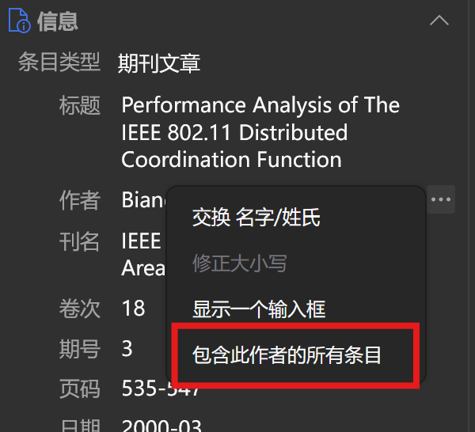

# Zotero Author Browser

该仓库正处于早期开发阶段。

该插件旨在简化一些对库内文章的作者的查看和统计操作。

[English](README.md) | [简体中文](README-zhCN.md)

## TODO

- [x] **显示作者的所有条目**：在项目列表中显示包含特定作者的所有条目
  - [x] 向右侧边栏内“创建者”（作者/编辑/贡献者/审稿人/译者）条目的上下文菜单添加显示包含该作者的所有条目的功能
- [x] **作者浏览器**：列出库内所有“创建者”，并按照库内关联的条目数量进行倒序排序
  - [x]双击作者条目时在主窗口中显示包含该作者的所有条目
- [ ] 实现“作者别名”功能，将多个同一“创建者”的不同别名归类至一个“主名”下
  - [ ] 在作者浏览器中不重复显示，并将条目数量合并
  - [ ] 在显示包含“创建者”的所有条目时合并显示
  - [ ] “作者别名”建议功能，识别库内作者姓名可能的缩写并建议合并
