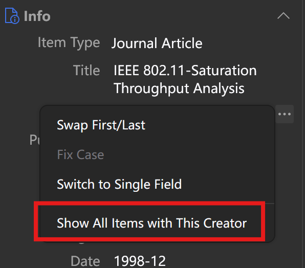

# Zotero Author Browser

This repo is under early development.

This addon simplifies viewing and statistics of authors/creators in a zotero library.

[English](README.md) | [简体中文](README-zhCN.md)

## TODO

- [x] **Show All Items with This Creator**. List all items associated with a certain author/creator.
  - [x] Add a _Show All Items with This Creator_ item to the context menu of creator items in the right side-bar.
- [ ] **Author Browser**. Lists all authors/creators in the library in reverse order of count of associated items.
  - [ ] _Show All Items with This Creator_ when the creator row is double clicked on
- [ ] **Author Aliases**. Associate multiple creator names to a _Main Name_ of the same person.
  - [ ] List only the _Main Name_ in _Author Browser_ and merge the item counts
  - [ ] List all items of all aliases of an author in _Show All Items with This Creator_.
  - [ ] Detect name abbreviations similar to other names in the library and guide users to create author alias.
